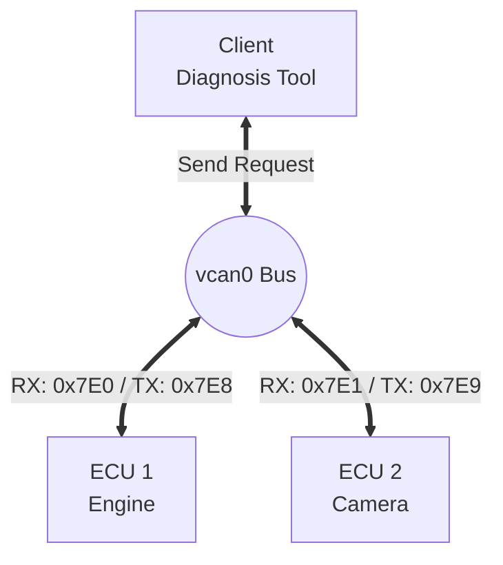

# 🚗 Virtual CAN & ISO-TP Multi-ECU Simulation

Linux **SocketCAN**과 **ISO-TP (ISO 15765-2)** 프로토콜을 활용하여 가상의 자동차 네트워크 환경을 구축하고, 다중 ECU 통신 및 패킷 분석을 수행한 프로젝트입니다.

하드웨어 장비 없이 `vcan` (Virtual CAN) 인터페이스를 통해 **Bus Topology**를 구현하고, Raw CAN 로그를 파싱하여 데이터 분할/재조립(Segmentation/Reassembly) 과정을 검증하는 도구를 포함하고 있습니다.

## 🛠 Architecture

모든 노드(Node)는 `vcan0` 버스를 공유하며, **CAN ID**를 통해 서로를 식별하고 통신합니다.



| Device | Role | RX ID (Listen) | TX ID (Send) | Description |
| :--- | :--- | :--- | :--- | :--- |
| **ECU 1** | Engine | `0x7E0` | `0x7E8` | RPM 상태 응답 |
| **ECU 2** | Camera | `0x7E1` | `0x7E9` | 장애물 감지 경고 (Long Data) |
| **Client** | Tester | (Dynamic) | (Dynamic) | 타겟에 맞춰 ID 변경 접속 |

## ⚙️ Prerequisites

이 프로젝트는 **Linux (Ubuntu 권장)** 환경에서 실행되어야 합니다.

### 1. System Requirements
* Linux Kernel (SocketCAN 지원)
* can-utils (패킷 모니터링 도구)

```bash
sudo apt update
sudo apt install can-utils
```

### 2. Python Dependencies
```bash
pip install python-can can-isotp
```

## 🚀 Setup & Installation

### 1. vcan 인터페이스 활성화
가상 CAN 장치를 생성하고 활성화합니다. (재부팅 시 다시 실행 필요)

```bash
sudo modprobe vcan
sudo ip link add dev vcan0 type vcan
sudo ip link set up vcan0
```

## 💻 Usage (Scenario)

총 4개의 터미널을 사용하여 전체 시나리오를 시뮬레이션합니다.

### Step 1. 데이터 로깅 (Terminal 1)
`candump`를 사용하여 버스 상의 모든 패킷을 파일로 저장합니다.
```bash
candump vcan0 > scenario.log
```

### Step 2. ECU 시뮬레이터 실행 (Terminal 2 & 3)
**엔진 ECU (Terminal 2)**
```bash
python3 smart_ecu.py --role engine --rx-id 0x7E0 --tx-id 0x7E8
```

**후방 카메라 ECU (Terminal 3)**
```bash
python3 smart_ecu.py --role camera --rx-id 0x7E1 --tx-id 0x7E9
```

### Step 3. Client 요청 전송 (Terminal 4)
Client 스크립트는 타겟을 지정하여 실행합니다.

**엔진에게 RPM 요청:**
```bash
python3 client.py --target Engine --tx-id 0x7E0 --rx-id 0x7E8 --msg "RPM?"
```

**카메라에게 장애물 확인 요청:**
```bash
python3 client.py --target Camera --tx-id 0x7E1 --rx-id 0x7E9 --msg "Obstacle?"
```

### Step 4. 로그 분석 및 검증 (Terminal 1)
Terminal 1에서 로깅을 중단(`Ctrl+C`)하고, 파서를 실행하여 ISO-TP 통신 과정을 분석합니다.
```bash
python3 log_parser_verbose.py scenario.log
```

## 📂 File Description

* **`smart_ecu.py`**: 다중 역할(Multi-Role) ECU 시뮬레이터. `--role` 인자에 따라 다른 응답 로직을 수행합니다.
* **`client.py`**: 범용 진단 클라이언트. 타겟 ID를 동적으로 설정하여 요청을 보냅니다.
* **`log_parser.py`**: Raw Hex 로그 분석기. ISO-TP 헤더(PCI)를 분석하여 SF, FF, CF, FC 프레임을 식별하고 메시지를 재조립합니다.

## 📊 Analysis Result Example

로그 파서 실행 시, 아래와 같이 암호화된 Hex 데이터가 사람이 읽을 수 있는 형태로 복원됩니다.

```plaintext
0x7e0    | SF   | Msg: RPM?
0x7e8    | FF   | Start Multi-Frame (Total: 65 bytes)
0x7e0    | FC   | Status: CTS (Continue)
0x7e8    | CF   | Sequence: 1
...
           └──> [COMPLETE] : Current RPM: 2500, Oil Temp: 90C...
```

## 📜 License

This project is licensed under the MIT License.